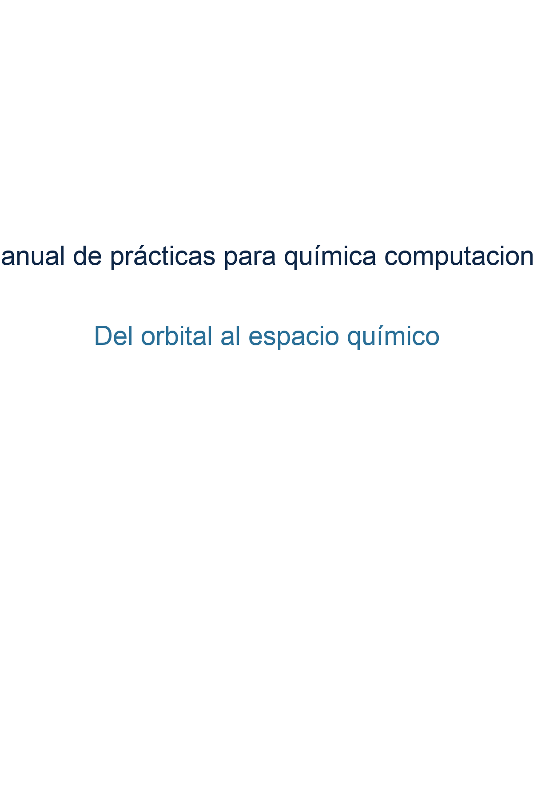

# Del orbital al espacio químico

**Manual de prácticas de química computacional**  
Eduardo Gabriel Guzmán-López · Miguel Reina  
UNAM · Facultad de Química · Grupo Dra. Annia Galano

---

Este manual cubre 55 prácticas organizadas en 20 bloques temáticos,
desde la generación de estructuras moleculares hasta el diseño de
fármacos asistido por inteligencia artificial.

## ¿Cómo usar este libro?

Cada práctica tiene dos partes:

- **🌱 Semilla** — un cálculo ejecutable que puedes correr ahora mismo,
  ya sea en tu servidor institucional o directamente en Google Colab.
- **🌳 Bosque** — un dataset pre-calculado de decenas a cientos de
  moléculas para análisis estadístico y visualización.

## Software

Las prácticas de estructura electrónica (Bloques 1–16) funcionan con
**ORCA 5** (gratuito para uso académico) o con **Gaussian 16**.
Usa las pestañas en cada práctica para seleccionar tu software:

````{tab-set}
```{tab-item} ORCA 5
:sync: orca
Selecciona esta pestaña para ver los inputs de ORCA en todas las prácticas.
```
```{tab-item} Gaussian 16
:sync: g16
Selecciona esta pestaña para ver los inputs de Gaussian 16.
```
````

Los Bloques 17–20 (quimioinformática e IA) usan exclusivamente
herramientas de código abierto: RDKit, scikit-learn, PyTorch y PyG.

## Ejecutar en la nube

Cada práctica incluye un botón para abrirla directamente en Google Colab:

[](https://colab.research.google.com/github/qcmanual/del-orbital-al-espacio-quimico/blob/main/notebooks/p01.ipynb)

## Estructura del manual

| Parte | Bloques | Prácticas | Tema |
|:------|:-------:|:---------:|:-----|
| I     | 1–6     | P01–P18   | Fundamentos y estructura electrónica |
| II    | 7–10    | P19–P30   | Análisis de propiedades y reactividad |
| III   | 11–16   | P31–P46   | Mecanismos y sistemas complejos |
| IV    | 17–20   | P47–P55   | Espacio químico e inteligencia artificial |

---

```{admonition} Primera vez aquí
:class: tip
Empieza por la Práctica 1.

<!-- Cuando existan estos archivos, reactivar enlaces internos:
Empieza por el {doc}`prefacio` para entender la filosofía del manual,
y luego revisa el {doc}`anexos/anexo_a` para configurar tu entorno
de cómputo antes de la Práctica 1.
-->
```

## Citar este recurso

Si encuentras útil esta obra para investigación o docencia, por favor cita:

> Guzmán-López, E. *Química Computacional: de la Mecánica Cuántica al Diseño Asistido por IA*. 2026.

---